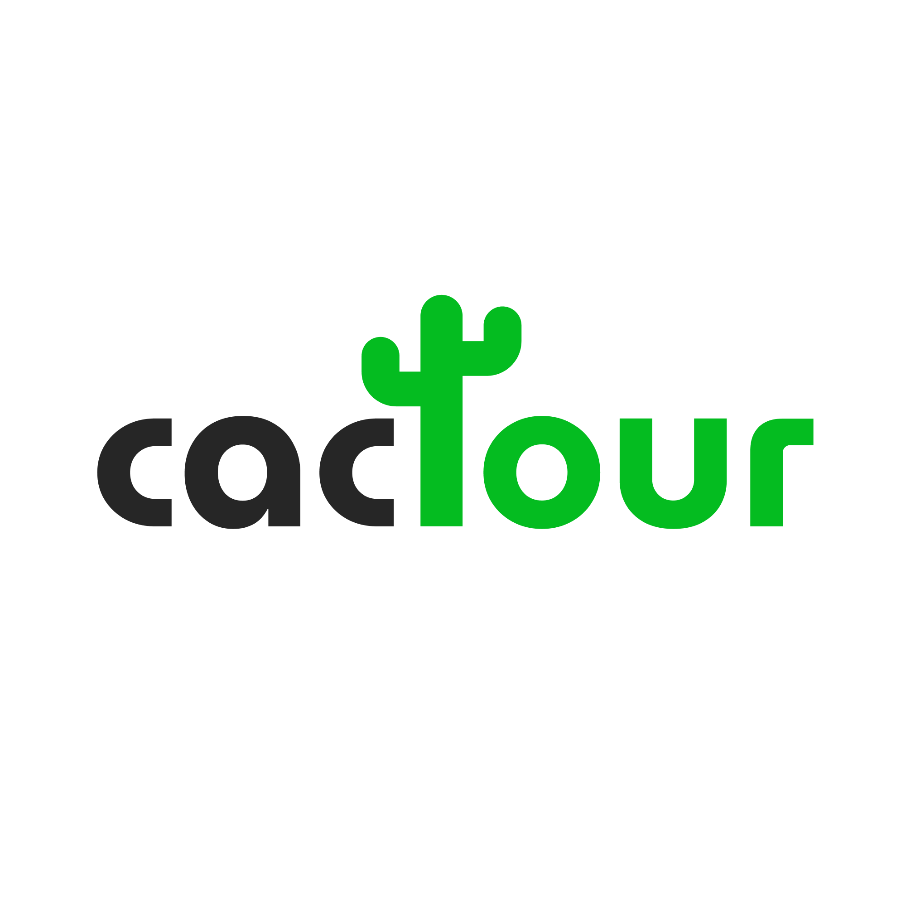

  

 # Cactour - Sistema de Gerenciamento de Pontos Turísticos 

Cactour é um sistema desenvolvido para o processo seletivo de estágio da Karnauba Software. O sistema é focado no gerenciamento de pontos turísticos de várias cidades, permitindo a criação e organização de cidades, locais (places) e eventos, com categorização por tipo, como gastronomia, paisagens, entre outros.

---

## Funcionalidades

- 🏙️ **Criação de cidades**  
  Apenas um administrador pode criar cidades, uma por vez.

- 📍 **Gerenciamento de locais (places) e eventos dentro das cidades**  
  Possibilidade de cadastrar e organizar locais turísticos e eventos.

- 🗂️ **Categorias para os locais e eventos**  
  Separação por categorias como gastronomia, paisagens, etc.

- 🔐 **Autenticação JWT**  
  Sistema seguro de autenticação baseado em JSON Web Tokens.

- 📧 **Recuperação de senha com Nodemailer**  
  Funcionalidade de "Esqueci a senha" para recuperação via e-mail.

---

## Protótipos e Design

O projeto foi prototipado no **Figma** e no **Excalidraw**, garantindo um design mais organizado, além do design do sistema para entender melhor as lógicas de como tudo iria funcionar.

---

## Tecnologias Utilizadas

### Frontend

- ⚛️ **React**  
  Utilizado para construir uma interface de usuário interativa e responsiva, permitindo uma experiência fluida.

- ⚡ **Vite**  
  Ferramenta de construção que proporciona um ambiente de desenvolvimento rápido e eficiente, com recarregamento instantâneo.

- 📝 **TypeScript**  
  Adiciona tipagem estática ao JavaScript, melhorando a manutenção e a escalabilidade do código.

- 🎨 **Tailwind CSS**  
  Framework CSS que permite estilização rápida e responsiva, facilitando a criação de layouts modernos.

- 📦 **Axios**  
  Biblioteca para realizar requisições HTTP, facilitando a comunicação com o backend.

### Backend

- 🟢 **Node.js**  
  Ambiente de execução para o backend, permitindo a construção de aplicações escaláveis.

- 🚀 **Fastify**  
  Framework web rápido e eficiente para o desenvolvimento do servidor, com suporte a plugins.

- 📝 **TypeScript**  
  Utilizado também no backend para garantir a consistência do código e facilitar a detecção de erros.

- 🗄️ **PostgreSQL**  
  Banco de dados relacional para armazenamento de dados, garantindo integridade e eficiência.

- 🗑️ **Redis**  
  Utilizado para caching e gerenciamento de tokens, melhorando a performance da aplicação.

- 🔗 **Prisma**  
  ORM para facilitar a interação com o banco de dados, permitindo consultas e manipulações de dados de forma intuitiva.

- 🐳 **Docker**  
  Para containerização da aplicação, garantindo portabilidade e consistência no ambiente de desenvolvimento e produção.

---

## Arquitetura do Projeto e Práticas Utilizadas

O backend foi desenvolvido seguindo os princípios do **SOLID** e do **Domain-Driven Design (DDD)**, adotando uma arquitetura limpa que prioriza simplicidade, organização e fácil entendimento por outros desenvolvedores.

---

## Estrutura Principal

- **Administração**: Criação e gerenciamento de cidades (exclusivo para administradores).
- **Cidades**: Cada cidade pode conter múltiplos locais e eventos.
- **Locais e Eventos**: Organizados por categorias.
- **Autenticação**: Sistema JWT para acesso seguro.
- **Recuperação de Senha**: Envio de e-mails para recuperação usando Nodemailer.

---

## Contato

Qualquer dúvida ou sugestão, fique à vontade para abrir uma issue ou nos contatar diretamente.

- 👤 [Claudio (@polinomiodetchebychev)](https://instagram.com/polinomiodetchebychev)  
- 👤 [Ricardo (@ricardokkdn)](https://instagram.com/ricardokkdn)

---

Obrigado por conferir a Cactour! 🚀
